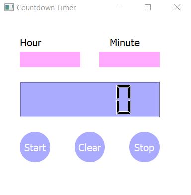
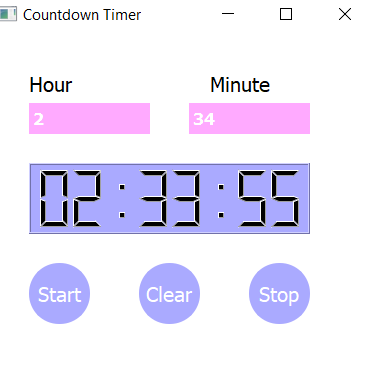

# ⏳ Countdown Timer - PyQt5

A simple and functional countdown timer built using **Python** and **PyQt5**.  
This app allows you to set a timer in hours and minutes, then displays the countdown in a digital LCD display.

---

## 🖥️ Features

- Set timer using hour and minute input
- Digital countdown display (`HH:MM:SS`)
- Start, Stop, and Clear controls
- PyQt5-based user interface (`.ui` file included)

---

## 📸 Screenshot

> *(You can see the main idea:)*  
> 
> 


### ✅ Requirements

- Python 3.x
- PyQt5

### 📦 Install dependencies

```bash
pip install pyqt5
